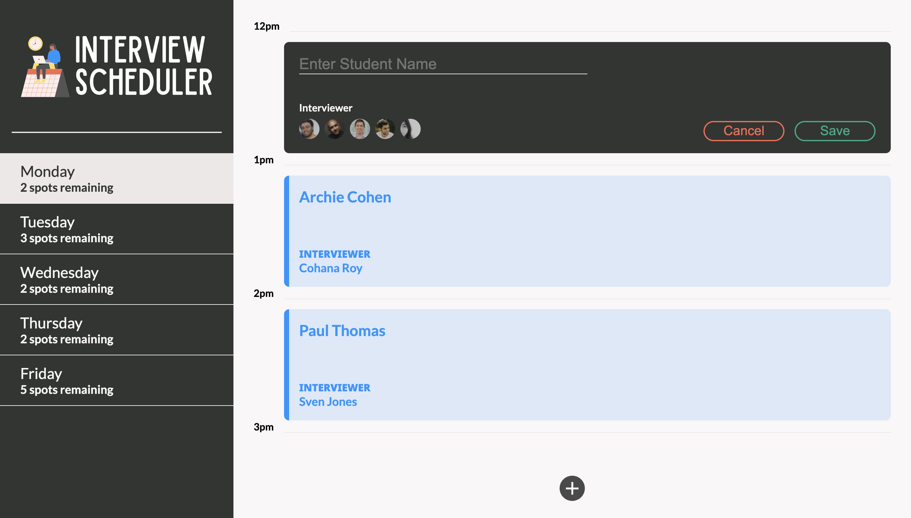
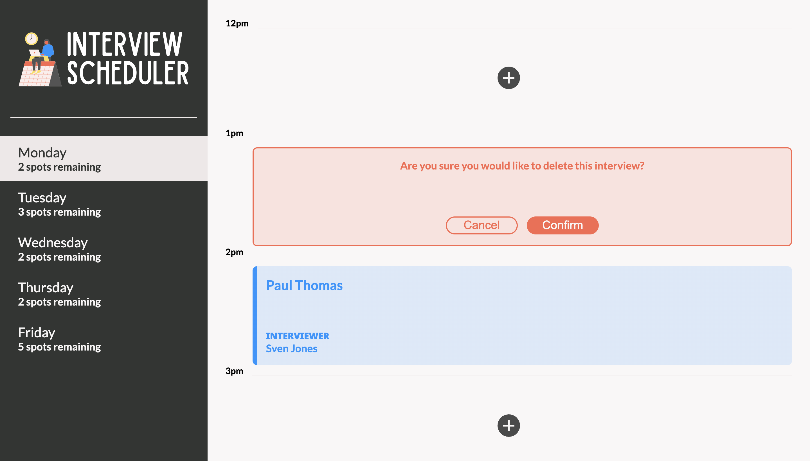

# Interview Scheduler

Interview Scheduler is single page React JS & MongoDB based full-stack application. It is live and deployed at: https://scheduler-sm.vercel.app/

<!-- This application also supports testing via the Jest, Storybook and Cypress frameworks. Testing via the Cypress framework requires an additional database to be setup and instructions are included below. -->

## Dependencies

- NextJS
- React 
- MongoDB
- Axios
- Cypress@9.7.0 (only if end-to-end testing will be done with cypress)

## Application snapshots

1. Main application page

2. Add a new appointment

3. Edit or delete an existing appointment

4. Edit an appointment

5. Delete an appointment

## Getting Started
1. Clone this repo to a folder named `scheduler` and enter `cd scheduler` on your CLI.
2. Run `npm install` on your CLI to install all dependencies.

### Database Setup
A test database must be created with seed data in it to allow for data persistence. 

1. Create a .env file in the root of the directory like the .env.example file and add your own connection string where it says <YOUR_URI>
2. Next, you will need to create the database itself. I will not be including full instructions to do this step. You can follow MongoDB's instructions to do this [here](https://learn.mongodb.com/courses/getting-started-with-mongodb-atlas).

3. Add a database named `schedular` to your M0 cluster. Add three collections, days, appointments and interviewers. Take a look a the schema required here: 

    A. Days: https://scheduler-sm.vercel.app/api/days
    B. Appointments: https://scheduler-sm.vercel.app/api/appointments
    C: Interviewers: https://scheduler-sm.vercel.app/api/interviewers

4. You can use the files appointments.json, days.json, interviewers.json to seed the database you create.

5. If the database & env file is set up properly, you should see the relevant days data when you visit </api/days>

### Application Setup
1. The next steps assume your database was setup and seeded properly in the Database Setup section.
2. Start the NextJS server using the `npm run dev` command in your scheduler CLI. The app will be typically served at <http://localhost:3000/>. 
3. Go to <http://localhost:3000/> in Google Chrome to access the application.
4. Test data from the database we setup must be visible at this time. 
5. Upon hovering an existing appointment, a user may edit or cancel it.
6. User will be asked to confirm their choice before deleting an appointment.
7. User may add a new appointment in any of the empty spots available by clicking the +/add button.
7. Data should persist after each change.

<!-- ## Testing

1. Storybook: `yarn run storybook`
2. Jest: `yarn test`
3. Cypress: For testing with Cypress a test database with deterministic data will need to be setup first and only then we can run Cypress. 
    - Duplicate the `.env.development` file to new`.env.test` in the root folder of scheduler-api, with one change `PGDATABASE=scheduler_test`
    - In psql create a new database called `scheduler_test` and connect to it. At this time your role must be, `development`.
    - In your scheduler-api CLI, run the server using `NODE_ENV=test npm start`
    - Seed the test database by visiting <http://localhost:8001/api/debug/reset>
    - Confirm the correct data shows up in the new test database by using the command below in your psql CLI
    `SELECT * FROM days JOIN appointments ON appointments.day_id = days.id LEFT JOIN interviews ON interviews.appointment_id = appointments.id ORDER BY appointments.id;`. You should see a single appointment for Archie Cohen on Monday.
    - Next, we can run Cypress in our CLI for scheduler via `yarn run cypress`. 

     -->
## Known issues

1. This application has only been tested in Google Chrome so far therefore behavior could be unexpected in other browsers.
2. The seed data is fake data.
3. This setup process assumes user has the Mongodb database `schedular` properly setup.

