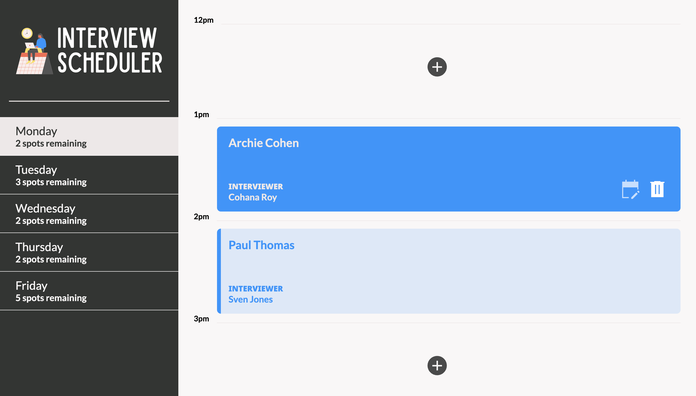

# Interview Scheduler

Interview Scheduler is single page a React JS based front-end application. It also uses HTML, CSS3 and SASS. 

It uses the [scheduler-api](https://github.com/lighthouse-labs/scheduler-api) as its API server to allow for data persistence. Follow the steps in the README file for the scheduler-api to set this up separately. A few additional steps are provided below to help with any setbacks.

This application also supports testing via the Jest, Storybook and Cypress frameworks. Testing via the Cypress framework requires an additional database to be setup and instructions are included below.

## Dependencies

- axios
- classnames
- normalize.css
- react 
- react-dom 
- react-scripts
- cypress@9.7.0 (only if end-to-end testing will be done with cypress)

## Application snapshots

1. Main application page

2. Add a new appointment

2. Edit or delete an existing appointment

2. Edit an appointment

2. Delete an appointment

## Getting Started
1. Clone this repo to a folder named `scheduler` and enter `cd scheduler` on your CLI.
2. Run `yarn install` on your CLI to install all dependencies.

### Database Setup
A test database (db) must be created with seed data in it. This must have been done in the steps for the scheduler-api above, but here are some steps below.

1. Clone the [scheduler-api](https://github.com/lighthouse-labs/scheduler-api) repo. `cd scheduler-api`
2. `npm install` to add all dependencies.
3. Start the PostgreSQL server by using the `psql` command in a second CLI window.
4. Change the .env.example file as noted in the scheduler-api README.
5. Check existing roles for your machine with `\du`. If a `development` role does not exist, create one with the following command
`CREATE ROLE development WITH SUPERUSER;`. Note that your current role must be a superuser to be able to create a new role.
6. Create the database using `CREATE DATABASE scheduler_development;`
7. Connect to the db using `\c scheduler_development`
8. In your scheduler-api CLI run `npm start` to start the server. You should see `Listening on port 8001 in test mode.` in your CLI.
9. Add seed data using the browser to navigate to <http://localhost:8001/api/debug/reset>
10. If the database is set up properly, you should see the relevant days data when you visit <http://localhost:8001/api/days>

### Application Setup
1. The next steps assume your database was setup and seeded properly in the Database Setup section.
2. Start the Webpack Development Server using the `npm start` command in your scheduler CLI. The app will be served at <http://localhost:3000/>. You should see a `Compiled successfully!` message on the CLI.
3. Go to <http://localhost:3000/> in Google Chrome to access the application.
4. Test data from the database we setup for the scheduler-api must be visible at this time. To confirm - the day Monday should show one appointment with Sylvia Palmer for student Archie Cohen. This ensures your data was loaded properly.
5. Upon hovering an existing appointment, a user may edit or cancel it.
6. User will be asked to confirm their choice before deleting an appointment.
7. User may add a new appointment in any of the empty spots available by clicking the +/add button.
7. Data should persist after each change.

## Testing

1. Storybook: `yarn run storybook`
2. Jest: `yarn test`
3. Cypress: For testing with Cypress a test database with deterministic data will need to be setup first and only then we can run Cypress. 
    - Duplicate the `.env.development` file to new`.env.test` in the root folder of scheduler-api, with one change `PGDATABASE=scheduler_test`
    - In psql create a new database called `scheduler_test` and connect to it. At this time your role must be, `development`.
    - In your scheduler-api CLI, run the server using `NODE_ENV=test npm start`
    - Seed the test database by visiting <http://localhost:8001/api/debug/reset>
    - Confirm the correct data shows up in the new test database by using the command below in your psql CLI
    `SELECT * FROM days JOIN appointments ON appointments.day_id = days.id LEFT JOIN interviews ON interviews.appointment_id = appointments.id ORDER BY appointments.id;`. You should see a single appointment for Archie Cohen on Monday.
    - Next, we can run Cypress in our CLI for scheduler via `yarn run cypress`. 
## Known issues

1. This application has only been tested in Google Chrome so far therefore behavior could be unexpected in other browsers.
2. The seed data is fake data.
3. This setup process assumes user has PostgreSQL database from the scheduler API properly setup.

